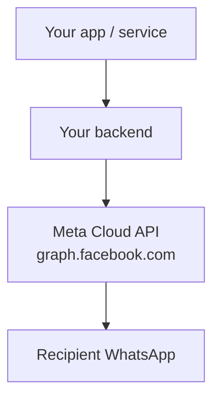

# WhatsApp Business Platform Integration Guide

A high-level guide for adding brand-initiated WhatsApp messaging via Meta's **WhatsApp Cloud API**. For API details, defer to [Meta's documentation](https://developers.facebook.com/documentation/business-messaging/whatsapp/overview).

---

## 1. Why the Business Platform

Store associates sending first-contact messages from personal or Business App accounts are getting restricted. See internal best-practices docs for the full problem analysis.

**The alternative:** send from a **brand-owned number** through the Cloud API instead of an associate's personal WhatsApp. Restrictions attach to the *sender* number — recipient phones are not at risk.

**What it gives you:** backend-initiated outreach using approved templates, with Meta managing quality and limits at the WABA level.

**What it does not give you:** free-form cold outreach — `type: text` only works after the client messages you first. Inbound replies and delivery webhooks are separate integrations.

---

## 2. Concepts

| Term | What it is |
|---|---|
| **Meta developer account** | Login at [developers.facebook.com](https://developers.facebook.com). Owns apps and API access. |
| **Business portfolio** | Meta Business Manager container for WABAs, phone numbers, and billing. A personal portfolio is fine for POC work. |
| **Meta app** | Developer app with the **WhatsApp** product added. Holds API credentials. |
| **WABA** (WhatsApp Business Account) | Business entity that owns templates, phone numbers, and messaging limits. |
| **Business phone number** | The WhatsApp number clients see as the sender. Distinct from the phone number ID. |
| **Phone number ID** | Numeric Graph API identifier (e.g. `106540352242922`). Used in API URLs — **not** the display number (e.g. `+85291234567`). |
| **Access token** | Bearer token for API calls. Short-lived (~24 h) from the dashboard; permanent via System User for production. **Never in a mobile app or git.** |
| **Message template** | Pre-approved, categorized message (marketing, utility, authentication). Required to start a conversation. |
| **Customer service window (CSW)** | 24-hour window opened when a user messages you. Unlocks free non-template replies. |
| **Graph API naming** | Cloud API lives at `graph.facebook.com`. Meta calls it the "Graph API" after Facebook's social graph. REST JSON over HTTPS with bearer auth. |

---

## 3. High-level architecture



**Token stays server-side.** The access token grants send-as-your-business. Your app knows only its own API URL — not Meta credentials.

Typical backend responsibilities: validate recipients, enforce rate limits, call `POST /{PHONE_NUMBER_ID}/messages`, map errors for the UI.

---

## 4. Meta onboarding

High-level checklist. Full walkthrough: [Get Started — WhatsApp Cloud API](https://developers.facebook.com/docs/whatsapp/cloud-api/get-started).

1. Create a [Meta developer account](https://developers.facebook.com) and a business portfolio ([business.facebook.com](https://business.facebook.com)) — personal portfolio is fine for POC.
2. Create an app → add the **WhatsApp** product. Meta auto-provisions a **test WABA + test phone number** (no payment method needed).
3. Copy **phone number ID**, **WABA ID**, and generate an **access token** from WhatsApp → API Setup.
4. Add up to **5 OTP-verified test recipients** (ordinary personal phones are fine).
5. Send the pre-approved `hello_world` template from the dashboard. Confirm it arrives.

**Done when:** a dashboard send reaches your phone — credentials work before any custom code.

**Common gotchas:** using the display phone number instead of phone number ID; unverified recipients; expired temporary token (error 190).

---

## 5. The send API call

Every outbound message is one HTTPS POST. Full reference: [Send messages](https://developers.facebook.com/docs/whatsapp/cloud-api/guides/send-messages).

```http
POST https://graph.facebook.com/v23.0/{PHONE_NUMBER_ID}/messages
Authorization: Bearer {ACCESS_TOKEN}
Content-Type: application/json
```

Replace `v23.0` with the current Graph API version from Meta's docs. `{PHONE_NUMBER_ID}` is the numeric ID from API Setup — not the display phone number.

### Request body — template (cold outreach)

```json
{
  "messaging_product": "whatsapp",
  "to": "85291234567",
  "type": "template",
  "template": {
    "name": "hello_world",
    "language": { "code": "en_US" }
  }
}
```

| Field | Purpose |
|---|---|
| `messaging_product` | Always `"whatsapp"`. |
| `to` | Recipient number — country code + national number, **digits only, no `+`** (e.g. `85291234567` for +852 9123 4567). |
| `type` | Message kind. **`template`** for business-initiated first contact; **`text`** (and image, etc.) only inside an open CSW after the client messages you. |
| `template.name` | Approved template identifier. Test WABAs include `hello_world`. |
| `template.language.code` | Template language (e.g. `en_US`). Must match an approved variant. |

### Request body — text (in-window reply)

Only usable when the client messaged you within the last 24 hours:

```json
{
  "messaging_product": "whatsapp",
  "to": "85291234567",
  "type": "text",
  "text": { "body": "Thanks for reaching out — your order is ready." }
}
```

Outside a CSW this returns error **131047** — send a template instead.

### Success response

```json
{
  "messaging_product": "whatsapp",
  "contacts": [{ "input": "85291234567", "wa_id": "85291234567" }],
  "messages": [{ "id": "wamid.HBgL..." }]
}
```

Save `messages[0].id` (the `wamid`) for logging. On failure, read `error.code` and `error.error_data.details` — see [Troubleshooting](#10-troubleshooting).

### `type` at a glance

| `type` | When to use | Cost (production) | Cold outreach? |
|---|---|---|---|
| **`template`** | Business-initiated first contact | Billable per delivery (category × country) | Yes |
| **`text`** (and image, etc.) | Reply inside an open CSW | Free today | No — client must message you first |

---

## 6. Staying free for demos and POC

Official pricing: [WhatsApp Business Platform pricing](https://developers.facebook.com/docs/whatsapp/pricing/).

**For demos, use Meta's test number** (auto-created in onboarding). It requires no payment method and incurs **no charges** for template sends to your up to 5 verified recipients.

If you later use a production number, the `type` field drives cost:

- **`type: template`** outside a CSW → billable. This is what cold outreach uses.
- **`type: text`** inside an open CSW → free today. Not usable for first contact.
- Utility templates inside an open CSW → free today.

**Practical demo rules:**
- Stay on the test number until you deliberately move to production.
- Use `hello_world` or other pre-approved templates — no custom template approval needed for POC.
- Keep recipient count small (test number cap: 5 verified numbers).
- Don't attach a payment method unless you're ready for production billing.

**October 2026 caveat:** third-party sources claim Meta will start charging for in-window service messages and utility templates from October 1, 2026. Meta's official pricing page still lists these as free — treat as unconfirmed and re-check before building a cost model.

---

## 7. Limits — what matters for demos

Full reference: [Messaging limits](https://developers.facebook.com/docs/whatsapp/messaging-limits/).

For POC and demo work you mostly need to know:

| Limit | What it means for you |
|---|---|
| **Test recipients** | Max 5 OTP-verified numbers on a test WABA |
| **Pair rate** | 1 message per 6 s to the same recipient (error 131056) |
| **Portfolio messaging tier** | New portfolios start at 250 unique recipients / 24 h — irrelevant at demo scale, matters in production |
| **Quality rating** | Blocks/reports on your *sender* number can flag or restrict outbound — avoid repeated identical outreach to unengaged users |

You won't hit throughput (80 msg/s) or tier limits in a POC. The pair rate limit is the one you'll feel if you tap Send repeatedly to the same number.

---

## 8. Do and don't

### Do

- **Get consent** before messaging.
- **Identify the sender** in templates (brand, store, advisor name).
- **Honor opt-out** — error 131050 means stop; do not retry.
- **Keep the access token on the server**, in `.env`, gitignored.
- **Use the test number** for all POC and early integration work.
- **Log every send** — timestamp, template, `wamid` or error code.

### Don't

- **Don't cold-outreach with `type: text`** — fails outside a CSW (error 131047).
- **Don't send repeated identical templates** to unengaged users — frequency caps (131049) and quality degradation.
- **Don't embed tokens** in mobile apps, commits, or Confluence.
- **Don't use personal WhatsApp** for brand-initiated template blasts.
- **Don't retry rate-limit errors immediately** — back off.

---

## 9. Going to production

When moving beyond POC:

- Register a **real business phone number** (test number cannot be promoted).
- Complete **business verification** to raise messaging tier (250 → 2,000+).
- Submit **custom templates** for approval (24–72 h).
- Use a **System User permanent token**; rotate on schedule.
- Add **webhooks** for delivery status and inbound replies.
- Attach **billing** and monitor per-country rate cards.

---

## 10. Troubleshooting

Full error reference: [Cloud API error codes](https://developers.facebook.com/docs/whatsapp/cloud-api/support/error-codes/).

Most common during integration:

| Code | Meaning | Fix |
|---|---|---|
| **190** | Expired / invalid token | Regenerate in dashboard or via System User |
| **100** | Bad parameter | Check phone format (digits, no `+`), template name, phone number ID in URL |
| **131047** | CSW closed | Use `type: template` instead of text |
| **132001** | Template missing / unapproved | Check name, language, approval status |
| **131056** | Pair rate limit | Wait ≥6 s before messaging same recipient again |
| **131049** | Frequency cap | Wait 24 h; review targeting |
| **131050** | User opted out | Remove from lists; do not retry |

Log `fbtrace_id` when contacting Meta support.

---

## References

- [WhatsApp Business Platform overview](https://developers.facebook.com/documentation/business-messaging/whatsapp/overview)
- [Cloud API — get started](https://developers.facebook.com/docs/whatsapp/cloud-api/get-started)
- [Send messages](https://developers.facebook.com/docs/whatsapp/cloud-api/guides/send-messages)
- [Pricing](https://developers.facebook.com/docs/whatsapp/pricing/)
- [Messaging limits](https://developers.facebook.com/docs/whatsapp/messaging-limits/)
- [Error codes](https://developers.facebook.com/docs/whatsapp/cloud-api/support/error-codes/)
